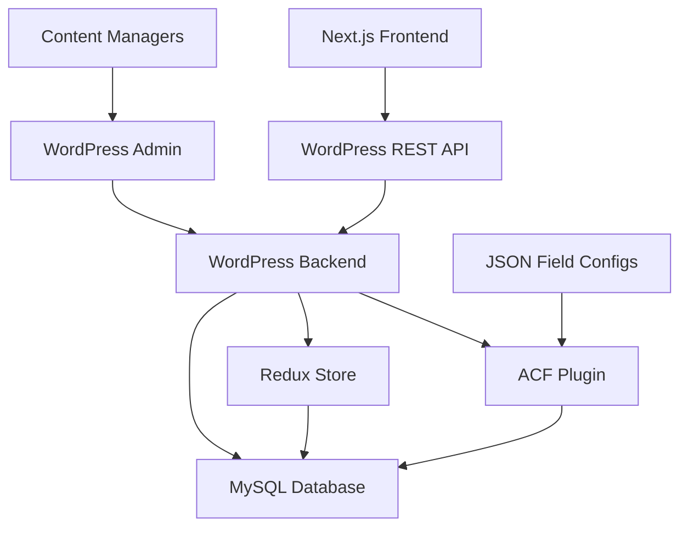

# WordPress ACF Integration Design Document

## Overview

This design document outlines the technical architecture for integrating a Next.js frontend with WordPress as a headless CMS, utilizing Advanced Custom Fields (ACF) for content management and Redux for state management. The system will transform static content into dynamic, API-driven content while maintaining performance and user experience.

## Architecture

### High-Level Architecture



### System Components

1. **Next.js Frontend Application**
   - Static site generation with dynamic data fetching
   - API client for WordPress communication
   - Component-based architecture with dynamic content rendering

2. **WordPress Headless CMS**
   - Custom post types for content organization
   - ACF field groups for structured data
   - REST API endpoints for data exposure
   - Redux integration for state management

3. **Data Layer**
   - MySQL database for content storage
   - ACF field storage and relationships
   - Redux state persistence

## Components and Interfaces

### WordPress Custom Post Types

#### Organization Members
```php
// Custom Post Type: rwua_members
Fields:
- member_name (Text)
- member_name_nepali (Text)
- member_role (Text)
- member_bio (Textarea)
- member_image (Image)
- member_contact (Group)
  - phone (Text)
  - email (Email)
- member_order (Number)
```

#### News Updates
```php
// Custom Post Type: rwua_news
Fields:
- news_title (Text)
- news_title_nepali (Text)
- news_content (Wysiwyg)
- news_excerpt (Textarea)
- news_featured_image (Image)
- news_category (Select)
- news_date_nepali (Text)
- news_tags (Text)
```

#### Gallery Items
```php
// Custom Post Type: rwua_gallery
Fields:
- gallery_title (Text)
- gallery_image (Image)
- gallery_description (Textarea)
- gallery_category (Select)
- gallery_order (Number)
```

#### Page Sections
```php
// Custom Post Type: rwua_sections
Fields:
- section_type (Select)
- section_title (Text)
- section_content (Flexible Content)
- section_background (Image)
- section_settings (Group)
```

### API Endpoints Structure

#### REST API Endpoints
```javascript
// Organization Members
GET /wp-json/wp/v2/rwua_members
GET /wp-json/wp/v2/rwua_members/{id}

// News Updates  
GET /wp-json/wp/v2/rwua_news
GET /wp-json/wp/v2/rwua_news/{id}

// Gallery Items
GET /wp-json/wp/v2/rwua_gallery
GET /wp-json/wp/v2/rwua_gallery/{id}

// Page Sections
GET /wp-json/wp/v2/rwua_sections
GET /wp-json/wp/v2/rwua_sections/{id}

// Custom Endpoints
GET /wp-json/rwua/v1/homepage-data
GET /wp-json/rwua/v1/navigation-menu
GET /wp-json/rwua/v1/site-settings
```

### Next.js Data Fetching Layer

#### API Client Structure
```typescript
// lib/wordpress-api.ts
interface WordPressAPI {
  getMembers(): Promise<Member[]>
  getNews(limit?: number): Promise<NewsItem[]>
  getGallery(category?: string): Promise<GalleryItem[]>
  getPageSections(page: string): Promise<Section[]>
  getHomepageData(): Promise<HomepageData>
}
```

#### Data Types
```typescript
interface Member {
  id: number
  name: string
  nepaliName: string
  role: string
  bio: string
  image: MediaItem
  contact: {
    phone?: string
    email?: string
  }
  order: number
}

interface NewsItem {
  id: number
  title: string
  titleNepali?: string
  content: string
  excerpt: string
  featuredImage: MediaItem
  category: string
  dateNepali: string
  tags: string[]
  publishedAt: string
}

interface GalleryItem {
  id: number
  title: string
  image: MediaItem
  description: string
  category: string
  order: number
}
```

## Data Models

### ACF Field Groups JSON Structure

#### Members Field Group
```json
{
  "key": "group_rwua_members",
  "title": "RWUA Member Fields",
  "fields": [
    {
      "key": "field_member_name",
      "label": "Member Name",
      "name": "member_name",
      "type": "text",
      "required": 1
    },
    {
      "key": "field_member_name_nepali",
      "label": "Member Name (Nepali)",
      "name": "member_name_nepali",
      "type": "text"
    },
    {
      "key": "field_member_role",
      "label": "Role",
      "name": "member_role",
      "type": "text",
      "required": 1
    },
    {
      "key": "field_member_bio",
      "label": "Biography",
      "name": "member_bio",
      "type": "textarea"
    },
    {
      "key": "field_member_image",
      "label": "Profile Image",
      "name": "member_image",
      "type": "image",
      "return_format": "array"
    },
    {
      "key": "field_member_contact",
      "label": "Contact Information",
      "name": "member_contact",
      "type": "group",
      "sub_fields": [
        {
          "key": "field_contact_phone",
          "label": "Phone",
          "name": "phone",
          "type": "text"
        },
        {
          "key": "field_contact_email",
          "label": "Email",
          "name": "email",
          "type": "email"
        }
      ]
    }
  ],
  "location": [
    [
      {
        "param": "post_type",
        "operator": "==",
        "value": "rwua_members"
      }
    ]
  ]
}
```

### Redux State Structure

#### WordPress Redux Store
```javascript
// Initial State
const initialState = {
  content: {
    members: [],
    news: [],
    gallery: [],
    sections: {}
  },
  ui: {
    loading: false,
    errors: {},
    lastUpdated: null
  },
  cache: {
    members: { timestamp: null, data: null },
    news: { timestamp: null, data: null },
    gallery: { timestamp: null, data: null }
  }
}

// Actions
const actions = {
  FETCH_CONTENT_START: 'FETCH_CONTENT_START',
  FETCH_CONTENT_SUCCESS: 'FETCH_CONTENT_SUCCESS',
  FETCH_CONTENT_ERROR: 'FETCH_CONTENT_ERROR',
  UPDATE_CONTENT: 'UPDATE_CONTENT',
  CLEAR_CACHE: 'CLEAR_CACHE'
}
```

## Correctness Properties

*A property is a characteristic or behavior that should hold true across all valid executions of a system-essentially, a formal statement about what the system should do. Properties serve as the bridge between human-readable specifications and machine-verifiable correctness guarantees.*

### Property 1: ACF Field Data Integrity
*For any* ACF field configuration imported from JSON, the field structure and validation rules should be preserved exactly as defined in the export file.
**Validates: Requirements 2.1, 2.2**

### Property 2: API Response Consistency  
*For any* WordPress REST API endpoint, the response format should remain consistent across all requests for the same content type.
**Validates: Requirements 6.1, 6.2, 6.3, 6.4**

### Property 3: Content Synchronization
*For any* content update in WordPress admin, the changes should be immediately available through the REST API without requiring manual cache clearing.
**Validates: Requirements 1.3, 3.1**

### Property 4: Redux State Consistency
*For any* Redux action dispatched in WordPress, the resulting state should accurately reflect the intended data modification.
**Validates: Requirements 4.2, 4.3**

### Property 5: Data Validation Integrity
*For any* ACF field with validation rules, invalid data should be rejected and appropriate error messages should be provided.
**Validates: Requirements 2.3, 8.3**

### Property 6: API Error Handling
*For any* API request that fails, the system should return appropriate HTTP status codes and structured error responses.
**Validates: Requirements 8.1, 8.2**

### Property 7: Image Processing Consistency
*For any* image uploaded through ACF fields, multiple sizes should be generated and metadata should be preserved.
**Validates: Requirements 3.4, 7.3**

### Property 8: Content Relationship Integrity
*For any* content with relationships to other content, the API should maintain referential integrity and provide proper linking.
**Validates: Requirements 2.4, 3.3**

## Error Handling

### WordPress Backend Error Handling
- ACF field validation errors with user-friendly messages
- Database connection error recovery
- Plugin dependency checks and graceful degradation
- Redux action error boundaries and state rollback

### API Error Responses
```json
{
  "error": {
    "code": "FIELD_VALIDATION_ERROR",
    "message": "Required field 'member_name' is missing",
    "details": {
      "field": "member_name",
      "type": "required_field"
    }
  }
}
```

### Next.js Frontend Error Handling
- API request timeout and retry logic
- Fallback content for missing data
- Error boundaries for component-level failures
- Loading states and skeleton components

## Testing Strategy

### Unit Testing
- ACF field validation functions
- Redux reducers and action creators
- API endpoint response formatting
- Next.js data fetching utilities

### Property-Based Testing
- **Property 1 Test**: Generate random ACF field configurations and verify import/export consistency
- **Property 2 Test**: Test API endpoints with various content types and verify response format consistency
- **Property 3 Test**: Create content updates and verify immediate API availability
- **Property 4 Test**: Dispatch random Redux actions and verify state consistency
- **Property 5 Test**: Submit invalid data to ACF fields and verify proper rejection
- **Property 6 Test**: Simulate API failures and verify error response format
- **Property 7 Test**: Upload various image formats and verify processing consistency
- **Property 8 Test**: Create content relationships and verify referential integrity

### Integration Testing
- WordPress to Next.js data flow
- ACF field group import process
- Redux state management across WordPress admin
- API endpoint functionality with real data

### Performance Testing
- API response times under load
- Image optimization and delivery speed
- Next.js build times with dynamic content
- Database query optimization validation